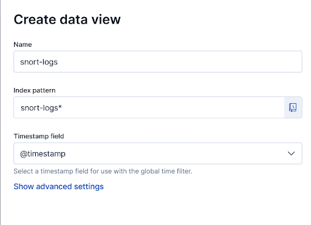

# Installation

Ce guide d'installation vous aidera à configurer le système de détection d'anomalies et de gestion de logs. Suivez les étapes ci-dessous pour installer les différents composants nécessaires.

## Prérequis

Avant de commencer l'installation, assurez-vous d'avoir un système basé sur Linux (de préférence Ubuntu 20.04 ou supérieur) avec les droits administratifs (sudo).

## Étapes d'installation

1. **Mettre à jour le système**

   ```bash
   sudo apt update && sudo apt upgrade -y
   ```

2. **Installer les dépendances nécessaires grâce au script d'installation**

   ```bash
   chmod +x install_stack.sh
   ./install_stack.sh
   ```

3. 

