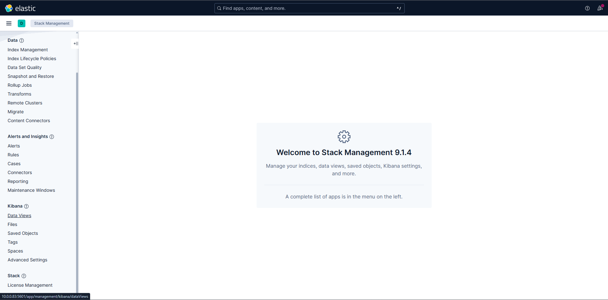
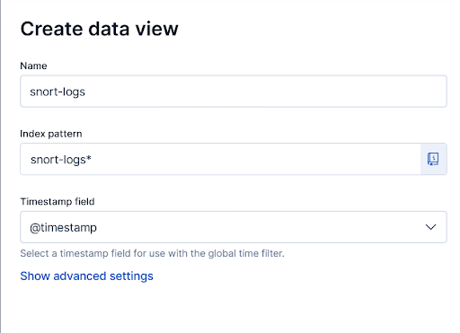

# Installation

Ce guide d'installation vous aidera à configurer le système de détection d'anomalies et de gestion de logs. Suivez les étapes ci-dessous pour installer les différents composants nécessaires.

## Prérequis

Avant de commencer l'installation, assurez-vous d'avoir un système basé sur Linux. Nous avons utilisé Ubuntu server (version 20.04.3 LTS) pour ce projet, téléchargeable depuis [le site officiel d'Ubuntu](https://ubuntu.com/download/server). Cette machine doit configurer son interface réseau en mode "bridge" pour permettre la communication avec d'autres machines sur le réseau local.
Il est également nécessaire d'avoir les droits administrateur (sudo) pour installer les paquets requis.


## Étapes d'installation

1. **Cloner le dépôt Git**

   ```bash
    git clone https://github.com/Coaraa/projet1-securite-informatique.git
    cd projet1-securite-informatique
   ```

2. **Installer les dépendances nécessaires grâce au script d'installation**

   ```bash
   chmod +x install.sh
   ./install.sh
   ```
   Ce script installera Snort, Elasticsearch, Kibana et syslog-ng. Il va également configurer les services afin qu'ils soient opérationnels.

3. **Créer un data view pour Kibana**

   Afin de terminer la configuration de Kibana, il est nécessaire de créer un "data view" pour permettre à Kibana de lire les données stockées dans Elasticsearch. Pour cela, suivez les étapes ci-dessous :

- Accédez à l'interface web de Kibana en ouvrant votre navigateur et en allant à l'adresse `http://<votre_adresse_ip>:5601`.

- Dans la barre latérale gauche, cliquez sur "Stack Management".


- Allez dans la section "Management" puis "Kibana" et sélectionnez "Data Views".



- Cliquez sur "Create data view".

- Entrez les informations comme sur l'image ci-dessous :
    - Pour "Data view name", mettez `snort-logs`
    - Pour "Index pattern", mettez `snort-logs*`

    

- Cliquez sur "Create data view" pour finaliser la création.

Vous pouvez maintenant utiliser Kibana pour visualiser les logs collectés par Snort dans l'onglet `Discover`.


## Vérification de l'installation

Pour vérifier que tous les services sont correctement installés et en cours d'exécution, utilisez les commandes suivantes :

```bash
sudo systemctl status snort
sudo systemctl status elasticsearch
sudo systemctl status kibana
sudo systemctl status syslog-ng
```
Chaque commande devrait indiquer que le service est "active (running)". Si un service ne fonctionne pas correctement, consultez les journaux pour diagnostiquer le problème.


Vous avez maintenant installé et configuré avec succès le système de détection d'anomalies et de gestion de logs. Vous pouvez commencer à utiliser Snort pour détecter les intrusions, Elasticsearch pour stocker les logs, et Kibana pour visualiser les données.